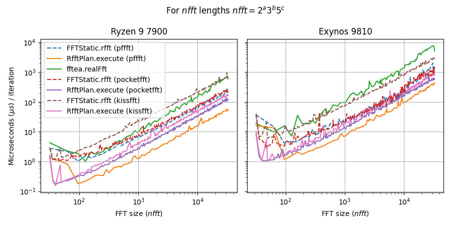
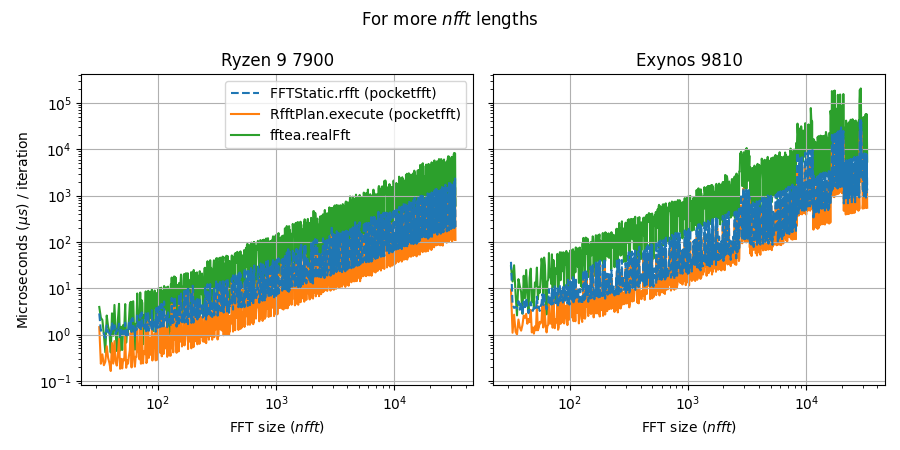

# open_dspc

[pub.dev/open_dspc](https://pub.dev/packages/open_dspc)

`open_dspc` is a Dart/Flutter package for **digital signal processing (DSP)** built on top of a lightweight **C library** accessed through `dart:ffi`.

The package provides efficient implementations of common DSP algorithms while offering a convenient Dart API suitable for Flutter apps, scientific tooling, and real-time audio processing.

## Features

- **Fourier transforms** — `fft`, `ifft`, `rfft`, `irfft`
- **Filtering & convolution** — FIR/IIR filtering (`lfilter`), convolution (direct / FFT)
- **Spectral analysis** — autocorrelation, linear and mel spectrograms
- **Signal analysis** — LPC (Levinson–Durbin, Burg), peak detection
- **Signal processing utilities** — resampling, framing
- **Mathematical tools** — polynomial fitting and evaluation (`polyfit`, `polyval`)
- **Signal generation** — sine/cosine signals, noise, sawtooth waves, pulses, sweeps
<!-- - **Voice features** — pitch, MFCC, HNR, CPP, spectral centroid -->

## Usage

```dart
import 'package:open_dspc/open_dspc.dart';
```

`open_dspc` provides both:
- `FFTStatic`, `Conv.direct`, `Resample.process`, ... for one-shot functional calls
- `RfftPlan`, `FftConvolver`, `Resampler`, ... for reusable native contexts with lower overhead

For repeated processing of many equally sized blocks, the reusable plan/context APIs
are typically faster because native setup and scratch buffers can be reused.

### ∿ Signals

```dart
final Float32List signal = SignalGenerator.sine(n: 1024, freqHz: 440.0, sampleRate: 16000.0);

```

### FFT

```dart

final Complex32List xFft = FFTStatic.rfft(x);
final Float32List xFftMag = FFTStatic.rfftMag(x);

final rfftPlan = RfftPlan(n);
final Complex32List cpx = rfftPlan.execute(x);
final Float32List mag = rfftPlan.executeMag(x);

```

Notes:
- `FFTStatic` is convenient for one-off transforms.
- `RfftPlan` is preferable when the same `n` is used repeatedly.

### ∗ Convolution

```dart
final x = Float32List.fromList([1, 1, 1, 1, 1]);
final y = Float32List.fromList([1, 1, 1, 1, 1]);
final xyFull = Conv.direct(x, y, outMode: CorrOutMode.full, simd: true);
// [1.0, 2.0, 3.0, 4.0, 5.0, 4.0, 3.0, 2.0, 1.0]
```

Notes:
- `ConvMode.convolution` and `ConvMode.xcorr` are both supported.
- `CorrOutMode.full`, `same`, and `valid` follow SciPy-style output conventions.
- `simd: true` enables the explicit SIMD path when supported by the target architecture.

### ↕ Resampling

```dart
final x = SignalGenerator.sine(n: 16000 * 8, freqHz: 440.0, sampleRate: 16000.0);
final y = Resample.process(x, origFreq: 16000, newFreq: 8000);
```

Notes:
- `Resample.process(...)` is the simplest entry point for single blocks.
- `Resampler(...)` is intended for repeated streaming or batch use with the same settings.

### ⚙ Example: reusable native plan

```dart
final plan = RfftPlan(1024);

final x1 = SignalGenerator.sine(n: 1024, freqHz: 440.0, sampleRate: 16000.0);
final x2 = SignalGenerator.sine(n: 1024, freqHz: 880.0, sampleRate: 16000.0);

final y1 = plan.executeMag(x1);
final y2 = plan.executeMag(x2);

plan.close();
```

This pattern is generally the best choice for benchmarking, real-time processing,
or any workload where the same transform/configuration is reused many times.


## FFT Benchmark Summary

`open_dspc` supports multiple native FFT backends: [pffft](https://github.com/marton78/pffft), [pocketfft-c](https://github.com/mreineck/pocketfft/tree/master), and [kissfft](https://github.com/mborgerding/kissfft) (plus a Dart-only baseline via [fftea](https://github.com/liamappelbe/fftea)).

Benchmarks were recorded on: **AMD Ryzen 9 7900** (Windows PC), **Apple M4** (MacBook), **Exynos 9810** (Samsung Galaxy S9, measured inside a Flutter isolate).

Across tested devices, **pffft** is generally the fastest backend for sizes it supports, due to its SIMD-oriented implementation.  
Its main limitation is supported transform lengths: `nfft = 2^a * 3^b * 5^c` with `a >= 5`.

Backend size support:
- **pffft**: `2^a * 3^b * 5^c`, `a >= 5`
- **pocketfft-c**: all sizes
- **kissfft**: even sizes only

Because **pocketfft-c** is typically the next fastest while supporting arbitrary sizes, the default native configuration uses a **hybrid backend**:
- use **pffft** when the size is supported
- otherwise fall back to **pocketfft-c**

The plots also show a clear benefit from **plan reuse** (`RfftPlan.execute`) over one-shot calls (`FFTStatic.rfft`), especially at smaller FFT sizes.  
For full benchmark scripts and raw results, see [`bench/`](bench/).





## Architecture

`open_dspc` consists of two layers:

**C core library**
- Portable DSP implementations written in C
- Optional SIMD acceleration
- FFT backends such as [pffft](https://github.com/marton78/pffft), [pocketfft](https://github.com/mreineck/pocketfft/tree/master), or [kissfft](https://github.com/mborgerding/kissfft)

**Dart bindings**
- Thin `dart:ffi` wrappers
- Memory-safe Dart APIs
- Support for both
  - **functional APIs** (single-shot operations)
  - **transform classes** (reusable contexts for performance)


## License

`open_dspc` is licensed under the [MIT License](LICENSE).

This repository also bundles third-party FFT implementations under their own
licenses. Which of these are included in a given native build depends on the
selected FFT backend. The default build uses `pffft` together with
`pocketfft-c` in the hybrid backend.

Bundled third-party licenses:

- `pffft`:
  BSD-style 3-clause license ([src/third_party/pffft/LICENSE.txt](src/third_party/pffft/LICENSE.txt))
- `pocketfft-c`:
  BSD-3-Clause ([src/third_party/pocketfft-c/LICENSE.md](src/third_party/pocketfft-c/LICENSE.md))
- `kissfft`:
  BSD-3-Clause ([src/third_party/kissfft/COPYING](src/third_party/kissfft/COPYING),
  [src/third_party/kissfft/LICENSES/BSD-3-Clause](src/third_party/kissfft/LICENSES/BSD-3-Clause))

